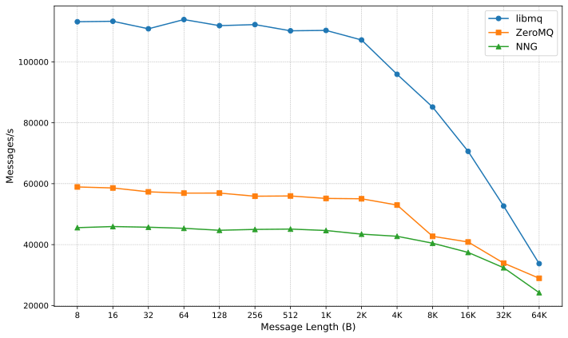
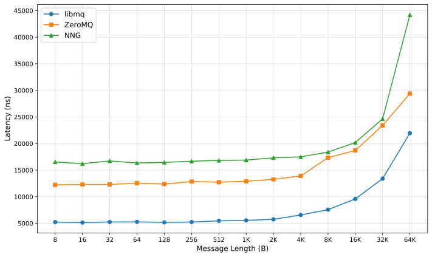

# libmq

Check the [examples](examples/).

## Benchmark

### Req/Rep Ping-Pong Throughput (TCP)

### Req/Rep Latency (TCP)

## License

libmq is licensed under the [MIT license](https://opensource.org/license/MIT).
